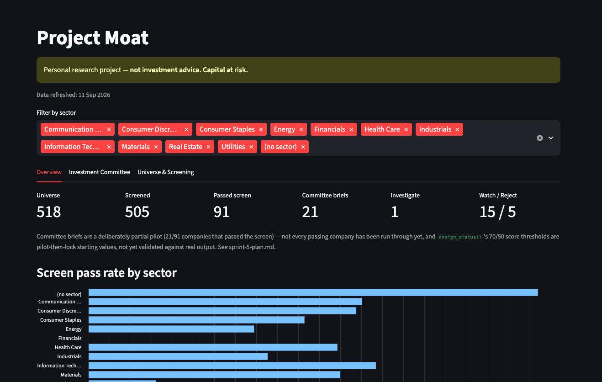
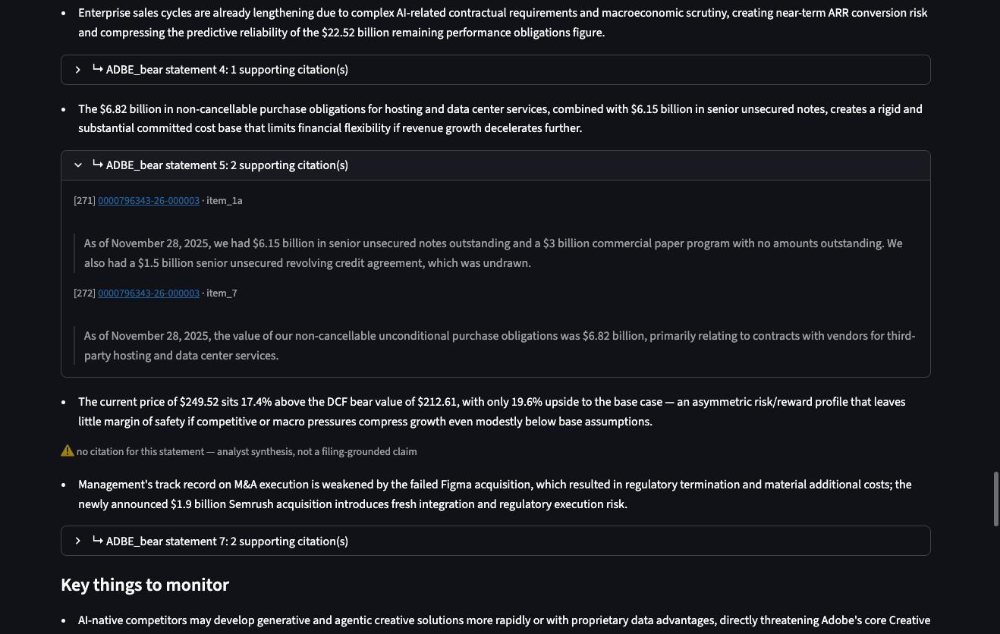
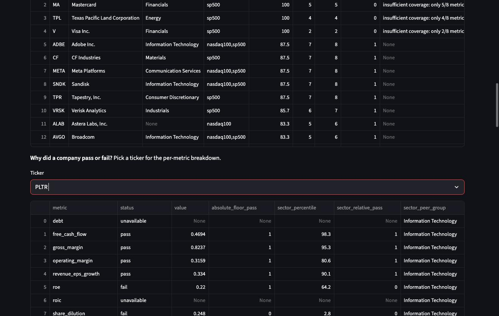
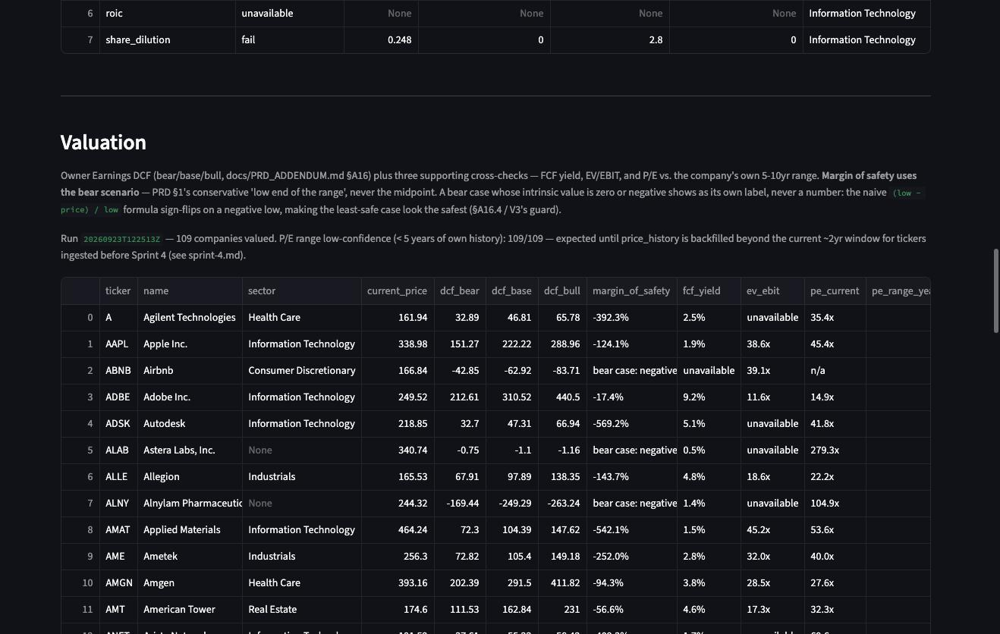

# Project Moat

## Can AI build a trustworthy investment-research pipeline?

An experiment in building a complex, data-heavy AI product responsibly.
Equity research is the domain — Buffett/Graham-style moat investing needs
someone to read filings, reason about qualitative evidence, and never
assert a number it can't source — but the product-management and
AI-engineering lessons are the point: staged rollout under a cost cap,
an independent adversarial review that runs on every push, and defects
found in *real* pilot output getting fixed without silent data loss.

**Not investment advice**, and not a substitute for the human "investment
committee" (you) — the dashboard says so on every screen.

**Stack:** Python, SQLite (one local file, no infra), Streamlit dashboard,
Claude API for the qualitative/valuation/committee stages.

**Headline numbers** (each sourced below — nothing here that can't be
pointed at a file). Auto-generated and checked on every push
(`scripts/metrics.py`, `docs/metrics.json`) — see Sprint 1 and Sprint 3.1
for the 91/505 screen result's history (it supersedes an earlier 93/505
figure) and the Sprint 3.1 retro for the 70-company/citation batch run:

<!-- metrics:start -->
| | | |
|---|---|---|
| 121 commits | 518-company universe, 506 with fundamentals | 109/505 pass the quant screen |
| 86 companies fully AI-analyzed, 2,883 citations | ~$28.1 total AI spend across every pilot to date | 330 tests, 329 passing (1 opt-in live-API test) |
| 14 GitHub issues filed, 12 open — tracked, not hidden | | |

Sources: commit count is `git rev-list --count HEAD`. Universe/fundamentals coverage and the screen result are cross-checked live against `data/moat.db` (Sprint 1 / Sprint 3.1 retros give the history). The AI-analyzed/citation figures are the Sprint 3.1 batch run. Spend is the analysis-stage total from `analysis_attempts.cost_estimate` (data-derived, all outcomes — a failed attempt still cost real money) plus the Sprint 5 committee pilot's spend, which the committee stage computes but doesn't persist, so that one figure stays hand-maintained (see `docs/metrics.json`). Test count is `pytest`'s own collection, run against `HEAD`. Issue count is [GitHub Issues](https://github.com/petehawtree/moat/issues). Generated by `scripts/metrics.py --render`, 2026-09-26.
<!-- metrics:end -->

**Read next:** [PRD_ADDENDUM.md](docs/PRD_ADDENDUM.md) (scoping decisions,
read before the original PRD) · [docs/sprints/](docs/sprints/) (what
actually happened, sprint by sprint) · [docs/known-issues.md](docs/known-issues.md)
(every open defect, why it's deferred) · [docs/dashboard-glossary.md](docs/dashboard-glossary.md)
(every value on screen, defined)

## The product in 60 seconds

**Overview** — the screening funnel (518 → 505 screened → 109 passed → 81
committee briefs → Investigate/Watch/Reject), with a caption explaining why
the other 28 passers have no brief and that the status thresholds aren't
validated yet:



**Investment Committee** — a brief (Adobe) showing resolved citations
(the actual 10-K quotes behind a claim, each linked to the filing on SEC
EDGAR) *and* a statement carrying the explicit "no citation" flag, side by
side:



**Universe & Screening** — a per-metric PASS/FAIL/UNAVAILABLE breakdown
(Palantir, showing all three):



**Valuation** — DCF range + margin of safety, including Airbnb's non-numeric
bear-case verdict where the sign-flip guard is doing its job (`bear case:
negative`, never a misleading percentage):



## The problem

Individual investors doing Buffett/Graham-style fundamental research don't
have institutional tooling: reading primary filings, screening a broad
universe on sector-relative fundamentals, and building a defensible
qualitative case for a "moat" all take hours per company and don't scale.
Project Moat asks how much of that can be handed to AI — cheaply, and
without asking a human to trust a number or a claim it can't trace back to
a source.

**Scope for now:** S&P 500 + NASDAQ 100 only, US (FTSE 350 deferred, §A1).
Free/near-free data only — SEC EDGAR XBRL (structured, high confidence) +
yfinance (prices, supplementary), with confidence tracked per record (§A4).

## How it works


Ingest → Screen → Quality → AI Analysis (citation-enforced) → Valuation →
Committee → **human decides**, with a watchlist monitor looping back to
re-trigger ingestion on its own. Green = shipped (Sprint 0–4). Light green
dashed = partially shipped (Sprint 5, in progress). Cream dashed = planned
(Sprint 6, still a stub). Gold = the one stage no sprint ever replaces.

**Every number traces back to a source.** A filing row, a price row, or a
citation — never asserted without a path to where it came from
(`docs/dashboard-glossary.md` defines every value; §A3/§A11 of the
addendum define the guarantee).

## Product principles

| Principle | What it looks like in the code |
|---|---|
| No metric without a source | Every fundamentals row joins back to the filing that reported it (§A11); every AI claim resolves to an accession + section + quote (§A3, §A15). |
| Missing data is not failure | Metrics report pass/fail/**unavailable**, scored as % of *assessable* metrics — a company that can't be measured isn't indistinguishable from one that did badly (§A14). |
| Sign-flip guards on every valuation output | A negative or zero denominator/intrinsic value returns an explicit non-numeric verdict, never a misleading number (§A16.4). |
| Cost is a first-class constraint | Every AI stage runs under an explicit spend cap; a re-run against unchanged inputs costs $0 (§A5). |
| Known problems are tracked, not hidden | [`docs/known-issues.md`](docs/known-issues.md) + 8 filed GitHub issues feed an adversarial independent review that runs on every push to `main`. |

## What went wrong

Ranked by how serious the failure actually was, not by how it reads.

| # | Failure | Severity | Caught by |
|---|---|---|---|
| 1 | Operating cash flow scored as free cash flow — 155 companies ranked on the wrong number | Serious — wrong investment signal | External review ([Sprint 2.2](docs/sprints/sprint-2-2.md)) |
| 2 | Risk score rewarded risk instead of penalizing it (`compute_overall_score()` polarity inverted) | Serious — recommendation logic backwards | Independent judge review of real pilot output ([Sprint 5](docs/sprints/sprint-5-plan.md)) — fixed, every persisted verdict recomputed in place, **no re-spend** |
| 3 | Missing data silently scored as a failing grade — 773 nulls | Serious — systematically penalized companies for gaps, not weakness | External review ([Sprint 2.2](docs/sprints/sprint-2-2.md)) |
| 4 | NVDA's DCF silently anchored on 15-year-old capex data | Moderate — one company's valuation range was wrong | Dry-run before shipping ([Sprint 4](docs/sprints/sprint-4.md)) |
| 5 | First batch submission crashed on an SDK version mismatch, never exercised by any prior test | Minor — caught at submission, no money lost | Immediate failure on the first real call ([Sprint 3.1](docs/sprints/sprint-3-1.md)) |
| 6 | 81% of filings hit `full_fallback` (whole document sent, not targeted sections) | Minor — cost inefficiency, not a wrong number | $1.80 mini-pilot on outlier filings ([Sprint 3.1](docs/sprints/sprint-3-1.md)); still 30% today, [GitHub #4](https://github.com/petehawtree/moat/issues/4) |

## How AI was used to build it

**Maker → Tests → Judge → Human → Pilot.** Claude Code implements against
the PRD and addendum; 330 tests gate correctness on every change; an
independent adversarial reviewer (`judge.sh`, a *different* model reading
the code and the database as untrusted claims — never assuming a test
passing means the behavior is correct) runs automatically on every push to
`main`; a human reads real output before thresholds get locked; every
AI-calling stage pilots on a small, deliberately-varied subset under an
explicit spend cap before a full run.

The judge returned `FAIL` 14 times in a row — not 14 independent bugs, but
the same small set of already-known, already-filed defects getting
re-discovered because the reviewer had no way to tell "known and tracked"
apart from "new breakage." Building [`docs/known-issues.md`](docs/known-issues.md)
as an explicit allowlist fixed that: the next run found two genuinely new
bugs, fixed them, and came back with this project's first
[non-`FAIL` verdict](docs/judge-reports/judge-report-sprint-5-first-clean-run-20260918-143831.md).

## Key decisions

| Decision | Reason |
|---|---|
| Citations are resolved from the API at call time into a durable anchor (accession + section + hash + offsets + quote), not authored by the model | A model-authored citation is a claim, not evidence — it has to still mean something after the source is re-fetched, re-chunked, or superseded (§A15.2/§A15.3) |
| An AI statement without a citation is shown with an explicit "no citation" flag, not rejected or hidden | The chosen control is surface support for a human to judge, not an automated citation-enforcement gate — decided up front, not discovered as a gap later (§A19.6) |
| All 8 screen metrics are scored against each company's own GICS sector, not one flat threshold | A bank and a software company don't share a capital structure or margin profile (§A2/§A9) |
| Known-bad tickers are excluded by default only at the Committee stage (the one producing a ranked recommendation); `ai_analysis`/`valuation` keep exclusion opt-in | A deliberate, scoped decision, not an oversight — see `sprint-5-plan.md` |

## Build history

| Sprint | Scope | Status |
|---|---|---|
| 0 | Repo scaffold, schema, pipeline skeleton | [done](docs/sprints/sprint-0.md) |
| 1 | Universe + price/fundamentals ingestion (US only) | [done](docs/sprints/sprint-1.md) |
| 2 | Sector-relative quant screen + ranked dashboard | [done](docs/sprints/sprint-2.md) (one metric defective, see 2.1) |
| 2.1 | Ingest data integrity + filing provenance | [done](docs/sprints/sprint-2-1.md) |
| 2.2 | Data integrity: FCF, REIT revenue, FAIL vs UNAVAILABLE | [done](docs/sprints/sprint-2-2.md) |
| 3 | AI business/moat/management/risk analysis (citation-enforced) | [done](docs/sprints/sprint-3.md) |
| 3.1 | Citation/batch backlog + the 70-company AI run | [done](docs/sprints/sprint-3-1.md) |
| 4 | Owner Earnings DCF + supporting valuation methods | [done](docs/sprints/sprint-4.md) |
| 5 | Investment Committee + one-page Investment Brief | [done](docs/sprints/sprint-5.md) — 81 companies scored; Investigate/Watch/Reject thresholds deferred to the external-benchmark eval |
| 6 | Watchlist monitoring | not started |

Longer-form lessons: [three bugs in structured financial data](docs/writeups/three-bugs-in-structured-financial-data.md)
· [what two code reviews found](docs/writeups/what-two-code-reviews-found.md).

## Product artefacts

- [Project_Moat_PRD_MVP.pdf](docs/Project_Moat_PRD_MVP.pdf) — original PRD
- [PRD_ADDENDUM.md](docs/PRD_ADDENDUM.md) — every scoping decision made since, overrides the PRD where they differ
- [docs/sprints/](docs/sprints/) — one retro per completed sprint
- [docs/judge-reports/](docs/judge-reports/) — every independent review run, including the 14 `FAIL`s before the allowlist existed
- [docs/known-issues.md](docs/known-issues.md) — every open defect and settled design decision, with why
- [docs/dashboard-glossary.md](docs/dashboard-glossary.md) — every value on the dashboard, defined

## Run it yourself

<details>
<summary>Setup</summary>

```bash
python3 -m venv .venv
source .venv/bin/activate
pip install -r requirements.txt
cp .env.example .env   # fill in MOAT_CONTACT_EMAIL (required by SEC EDGAR) and ANTHROPIC_API_KEY
python scripts/run_pipeline.py --init-db --init-only
pytest
```

Reproduce the pipeline: `python scripts/run_pipeline.py --init-db` (add
`--init-only` to just create the schema), then
`python scripts/run_pipeline.py --from-stage screen`.

Run the dashboard:

```bash
streamlit run moat/dashboard/app.py
```

### Repo layout

```
moat/
  ingest/       # universe, price, fundamentals fetchers
  screen/       # deterministic quant screen (sector-relative)
  quality/      # pre-AI deterministic quality score
  analysis/     # Claude-based qualitative analysis (citation-enforced)
  valuation/    # Owner Earnings DCF + supporting methods
  committee/    # 3-persona consolidation + final weighted score (Sprint 5)
  monitor/      # watchlist diffing and triggers
  db/           # SQLite schema + connection helper
  dashboard/    # Streamlit app
scripts/        # run_pipeline.py and future one-off scripts
docs/           # PRD + addendum
tests/
```

</details>

## License

All rights reserved — see [LICENSE](LICENSE). This repo is public for
portfolio review; it isn't licensed for reuse.
