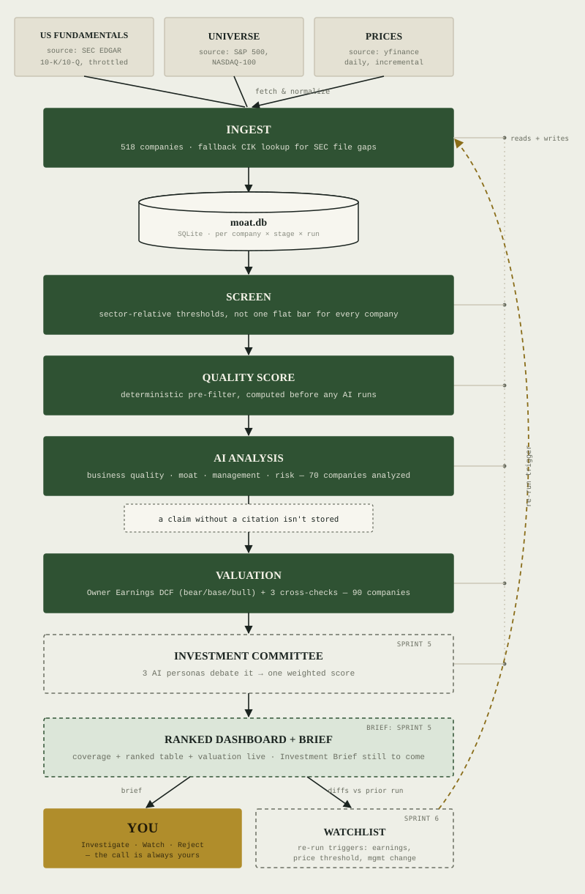

# Project Moat

AI-assisted equity research tool built on Buffett/Graham fundamental
investing principles. Personal research tool — not investment advice, and
not a substitute for the human "investment committee" (you).

Full spec: `docs/Project_Moat_PRD_MVP.pdf` (original PRD) +
[`docs/PRD_ADDENDUM.md`](docs/PRD_ADDENDUM.md) (scoping decisions made
during Sprint 0 — read this first, it overrides the PRD where they differ).

What actually happened each sprint — results, bugs found, scope calls — is
in [`docs/sprints/`](docs/sprints/).

## Architecture



Green = shipped (Sprint 0–1). Dashed = planned (Sprint 2–6, still stubs).
Gold = the one thing no sprint replaces.

## Status

**Sprint 1 — data foundation and company universe. Done.**
- Universe: 518 unique US companies (S&P 500 + NASDAQ 100, deduplicated).
- Fundamentals: 505/518 (97.5%) via SEC EDGAR XBRL. The 13 gaps are
  explained, not bugs — see [`docs/PRD_ADDENDUM.md`](docs/PRD_ADDENDUM.md) §A7.
- Prices: 518/518 (100%) via yfinance.
- 8 tests passing (schema + offline extraction-logic regression tests).

Run `python scripts/run_pipeline.py --init-db` to reproduce.

Sprints 2-6 (screen/quality/ai/valuation/committee/monitor) are still
documented stubs — see the sprint table below.

## Scope for now

- **Universe:** S&P 500 + NASDAQ 100 only (US). FTSE 350 is deferred —
  see addendum §A1.
- **Data:** free/near-free sources only — SEC EDGAR (structured, high
  confidence) + yfinance (prices, supplementary). See addendum §A4 for
  how confidence is tracked per record.
- **Screening:** sector-relative, not one flat threshold for every company
  — see addendum §A2.
- **Stack:** Python, SQLite (single local file, no infra), Streamlit
  dashboard, Claude API for the qualitative/valuation/committee stages
  (Sprint 3+).

## Sprint plan

| Sprint | Scope | Summary |
|---|---|---|
| 0 | Repo scaffold, schema, pipeline skeleton — **done** | [sprint-0.md](docs/sprints/sprint-0.md) |
| 1 | Universe + price/fundamentals ingestion (US only) — **done** | [sprint-1.md](docs/sprints/sprint-1.md) |
| 2 | Sector-relative quant screen + ranked dashboard *(next)* | |
| 3 | AI business/moat/management/risk analysis (citation-enforced) | |
| 4 | Owner Earnings DCF + supporting valuation methods | |
| 5 | Investment Committee + one-page Investment Brief | |
| 6 | Watchlist monitoring | |

## Setup

```bash
python3 -m venv .venv
source .venv/bin/activate
pip install -r requirements.txt
cp .env.example .env   # fill in MOAT_CONTACT_EMAIL (required by SEC EDGAR) and ANTHROPIC_API_KEY
python scripts/run_pipeline.py --init-db
pytest
```

## Repo layout

```
moat/
  ingest/       # universe, price, fundamentals fetchers
  screen/       # deterministic quant screen (sector-relative)
  quality/      # pre-AI deterministic quality score
  ai/           # Claude-based qualitative analysis (citation-enforced)
  valuation/    # Owner Earnings DCF + supporting methods
  committee/    # 3-persona consolidation + final weighted score
  monitor/      # watchlist diffing and triggers
  db/           # SQLite schema + connection helper
  dashboard/    # Streamlit app
scripts/        # run_pipeline.py and future one-off scripts
docs/           # PRD + addendum
tests/
```

## Running the dashboard

```bash
streamlit run moat/dashboard/app.py
```
